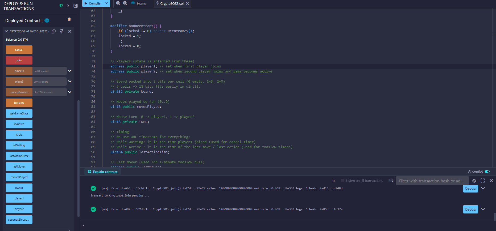

# CryptoSOS — Secure On-Chain Game Contract

CryptoSOS is a fully on-chain implementation of the classic SOS board game built in Solidity, featuring incentive-aligned gameplay, timeout enforcement, and production-level smart contract security patterns.

The project focuses on deterministic state transitions, gas efficiency, and adversarial resilience.

---

## Overview

CryptoSOS implements a two-player competitive game deployed entirely on Ethereum. All state transitions, board updates, and fund transfers occur on-chain without off-chain dependencies.

The contract enforces:

- Strict turn-based gameplay
- Economic commitment via deposits
- Deterministic resolution logic
- Time-based inactivity handling
- Secure payout mechanisms

---

## Architecture

The contract operates as a finite-state machine:

- `Idle`
- `WaitingForPlayer`
- `Active`

Game state is inferred from player addresses and timestamps, minimizing redundant storage.

The board is stored as a bit-packed `uint32`, using 2 bits per cell (9 cells total), significantly reducing gas costs compared to naive array storage.

---

## Incentive & Game Economics

- Fixed entry deposit per player
- Winner-takes-majority payout
- Tie refund logic
- Timeout-based win condition
- Owner-controlled residual sweep (transparent and callable)

All transfers occur only after state reset to eliminate reentrancy risk.

---

## Security Engineering

The contract implements multiple defensive patterns:

- Reentrancy guard modifier
- Checks-Effects-Interactions pattern
- Strict phase validation
- Self-play prevention
- Explicit ownership controls
- Timestamp-based inactivity enforcement
- Storage packing for gas efficiency

Special attention was given to preventing:
- Reentrancy attacks
- Invalid state transitions
- Fund locking scenarios
- Replay-style manipulation

---

## Gas Optimization Techniques

- Bitwise board encoding
- Immutable owner variable
- Minimal storage footprint
- Packed state representation

---

## Deployment & Testing

The contract was deployed and tested in Remix using simulated accounts, including:

- Full gameplay cycle
- Timeout scenarios
- Draw resolution
- Withdrawal logic validation
- Attack simulation attempts

---

## Potential Extensions

- Frontend integration (React + ethers.js)
- ERC-20 based deposits
- Tournament mode
- Commit-reveal anti-front-running scheme
- Upgradeable proxy pattern

---

## Tech Stack

- Solidity
- Remix IDE
- Ethereum Virtual Machine

- ## Example Deployment (Remix)

